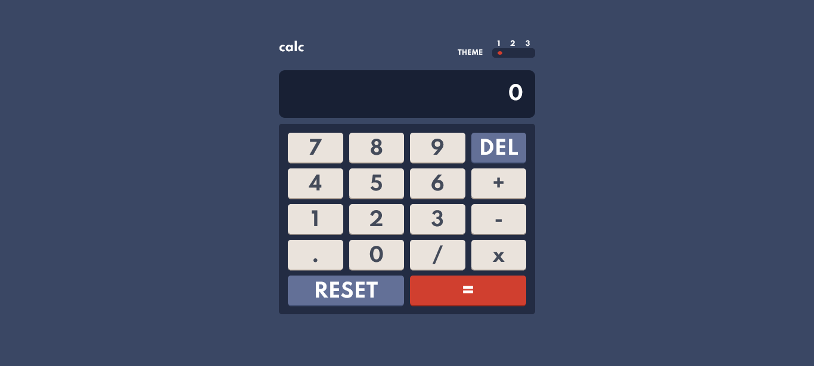

# Frontend Mentor - Calculator app solution

This is a solution to the [Calculator app challenge on Frontend Mentor](https://www.frontendmentor.io/challenges/calculator-app-9lteq5N29). Frontend Mentor challenges help you improve your coding skills by building realistic projects. 

## Table of contents

- [Overview](#overview)
  - [The challenge](#the-challenge)
  - [Screenshot](#screenshot)
  - [Links](#links)
- [My process](#my-process)
  - [Built with](#built-with)
  - [What I learned](#what-i-learned)
  - [Continued development](#continued-development)
  - [Useful resources](#useful-resources)
- [Author](#author)
- [Acknowledgments](#acknowledgments)

**Note: Delete this note and update the table of contents based on what sections you keep.**

## Overview

### The challenge

Users should be able to:

- See the size of the elements adjust based on their device's screen size
- Perform mathmatical operations like addition, subtraction, multiplication, and division
- Adjust the color theme based on their preference
- **Bonus**: Have their initial theme preference checked using `prefers-color-scheme` and have any additional changes saved in the browser

### Screenshot



### Links

- Solution URL: [Add solution URL here](https://github.com/DamianErasmus/calculator)
- Live Site URL: [Add live site URL here](https://decalculator.netlify.app/)

## My process

### Built with

- HTML5
- CSS
- Flexbox
- CSS Grid
- Javascript

### What I learned

```html
<button class="btn_del" data-action="delete">DEL</button>
	I never thought about adding a data-action to a button, so effective

<link rel="stylesheet" href="css/default.css" id="theme">
	I just learned that your links in the head can be assigned with an id
```
```css
input[type='radio'] {
    -webkit-appearance: none;
    width: 20px;
    height: 10px;
    border-radius: 50%;
    outline: none;
}

input[type='radio']:before {
    content: '';
    display: block;
    width: 40%;
    height: 60%;
    margin: 20% auto;
    border-radius: 50%;
}
	I didn't think changing the style of radio buttons would be this tricky, I needed google for this one
```
```js
document.getElementById('theme').setAttribute('href', 'css/default.css');
	I learned that you can change the attribute of the link to the style sheet
}
```

### Continued development

I want to figure out the *Bonus part, but for now I've learned quite a lot already and would like to move on to another project

### Useful resources

- [Freecodecamp](https://www.freecodecamp.org) - This helped me figure out the javascript of the calculator
- [YouTube](https://www.youtube.com) - For step by step instructions for figuring out new concepts, like the attribute change in javascript, YouTube is the king!


## Author

- Website - [Damian](https://damianerasmus.com)
- Frontend Mentor - [@DamianErasmus](https://www.frontendmentor.io/profile/DamianErasmus)

## Acknowledgments

Zell Liew from FreeCodeCamp, you really helped me figure out the brainbreaking javascript in a very informative manner, thanks!
